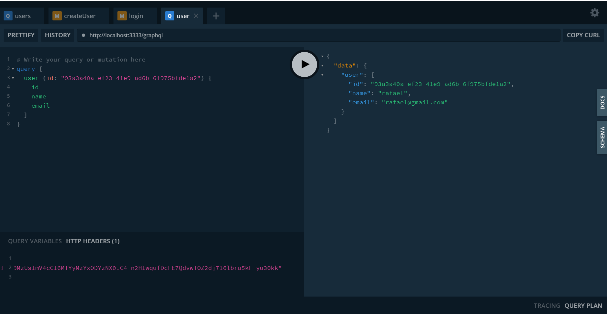

<p align="center">
  
</p>

## ✨ Tecnologias

Esse projeto foi desenvolvido com as seguintes tecnologias:

- [Nestjs](https://nestjs.com/)
- [TypeScript](https://www.typescriptlang.org/)
- [Graphql](https://graphql.org/)
- [Apollo Graphql](https://www.apollographql.com/)
- ... e outros

## 💻 Projeto

Este projeto é uma API que fornece informações para um frontend ele tem como objetivo aplicar algumas tecnologias de forma prática.

## Ambiente de desenvolvimento

```bash
node --version
v16.0.0

yarn --version
1.22.4
```

## 🚀 Como executar

- Instale a CLI do Nestjs
```bash
npm i -g @nestjs/cli
```

- Clone o repositório
- Instale as dependências com `yarn`

```bash
yarn install
```

- Inicie o servidor com `yarn`

```bash
yarn start:dev
```

- A aplicação pode ser acessada em [`localhost:3333`](http://localhost:3333).
- Acesse o GraphQL Playground [`localhost:3333/graphql`](http://localhost:3333/graphql).
- Execute o Front-end que está [aqui](https://github.com/rafael-angonese/twitter-clone-web-next-graphql)

## 📄 Licença

Esse projeto está sob a licença MIT. Veja o arquivo [LICENSE](LICENSE.md) para mais detalhes.

---

Feito com ♥ by Rafael Angonese
